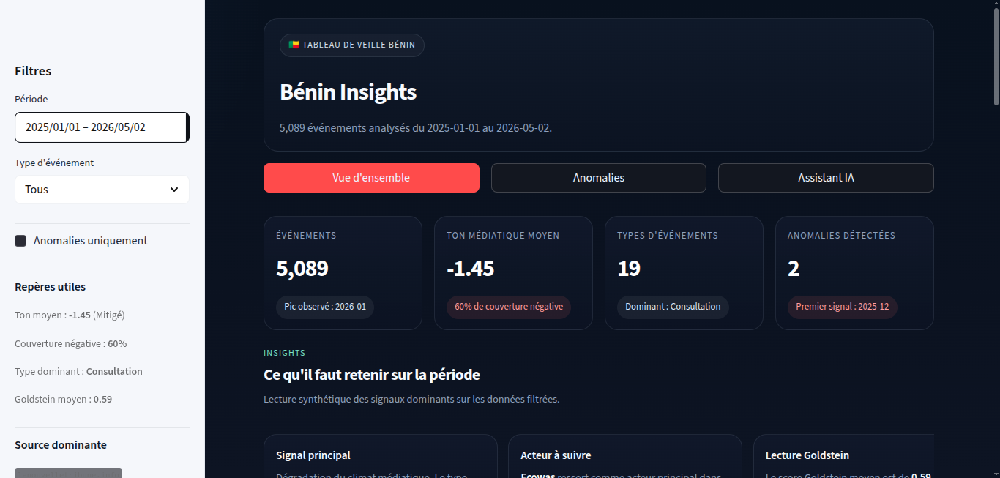

# 🇧🇯 Bénin Insights — GDELT Analytics & Dashboard (Team 2)
> Analyse des données GDELT sur le Bénin (jan 2025 – avr 2026)
> iSHEERO × DataCamp Donates | Hackathon 2026

---

## Demo



Lien demo : http://benin-insights.adandeappolinaire.me


## Ce que nous avons fait

- Data : pipeline ETL reproductible vers `data/processed`.
- Analyses : notebooks exploratoires + rapports dans `reports/`.
- Modeles : 3 modeles principaux + un modele de prediction pour estimer, des le debut d'un evenement, son ampleur potentielle (entrainement/score dans `models/`, modules dans `src/models/`).
- Tests : suite `pytest` sur les modeles et validations critiques.
- CI/CD : CI (tests + smoke checks) et CD (build/push image + deploy dashboard).

## Getting started

### Sans Docker

```bash
git clone https://github.com/Rabbi-GEEK/benin-insights-challenge-team2
cd benin-insights-challenge-team2

python -m venv venv
source venv/bin/activate  # ou venv\Scripts\activate
pip install -r requirements.txt
python pipeline/main.py
streamlit run dashboard/app.py
```

> **Les donnees brutes sont deja dans `data/raw/` — pas besoin de BigQuery.**  
> Les commandes ci-dessus regenerent `data/processed/` depuis `data/raw/`.

### Avec Docker (dashboard)

```bash
git clone https://github.com/Rabbi-GEEK/benin-insights-challenge-team2
cd benin-insights-challenge-team2
docker compose -f docker-compose.streamlit.yml up --build
```

L'app est exposee sur `http://localhost:8503` (ou `DASHBOARD_PORT`).

---

## Structure

```
├── .github/workflows/          # CI/CD
├── dashboard/                  # App Streamlit (vues modulaires)
├── dashboard /                 # Pages Streamlit (multipage)
├── data/
│   ├── raw/                    # Données brutes
│   └── processed/              # Données nettoyées et agrégées
├── deploy/nginx/               # Config reverse-proxy
├── docs/                       # Dossier de soumission et specs
├── models/                     # Entrainement et evaluation ML
├── notebooks/                  # Analyses exploratoires
├── pipeline/                   # ETL (extract/transform/load)
├── reports/                    # Rapports et assets
├── src/                        # Modules reutilisables + tests
├── docker-compose.streamlit.yml
├── Dockerfile.streamlit
└── requirements.txt
```

---


