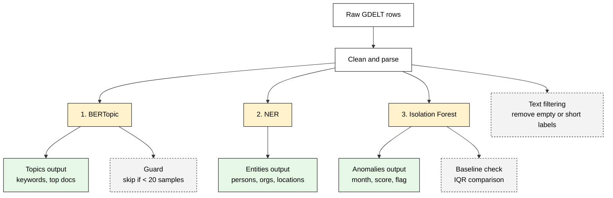

# Diagramme : Pipeline des modèles

```mermaid
flowchart TD
  A[Raw GDELT rows] --> B[Clean and parse]

  B --> C1["1. BERTopic"]
  B --> C2["2. NER"]
  B --> C3["3. Isolation Forest"]

  C1 --> D1["Topics output\nkeywords, top docs"]
  C2 --> D2["Entities output\npersons, orgs, locations"]
  C3 --> D3["Anomalies output\nmonth, score, flag"]

  B --> N1["Text filtering\nremove empty or short labels"]
  C1 --> N2["Guard\nskip if < 20 samples"]
  C3 --> N3["Baseline check\nIQR comparison"]

  classDef core fill:#ffffff,stroke:#111111,stroke-width:1px,color:#000000;
  classDef model fill:#fff2cc,stroke:#111111,stroke-width:1px,color:#000000;
  classDef out fill:#e6f7e6,stroke:#111111,stroke-width:1px,color:#000000;
  classDef note fill:#f3f3f3,stroke:#111111,stroke-width:1px,stroke-dasharray: 3 3,color:#000000;
  class A,B core;
  class C1,C2,C3 model;
  class D1,D2,D3 out;
  class N1,N2,N3 note;
```

Ce diagramme décrit la logique actuelle des modèles : préparation → trois modèles (1. BERTopic, 2. NER, 3. Isolation Forest) → sorties comparatives.
